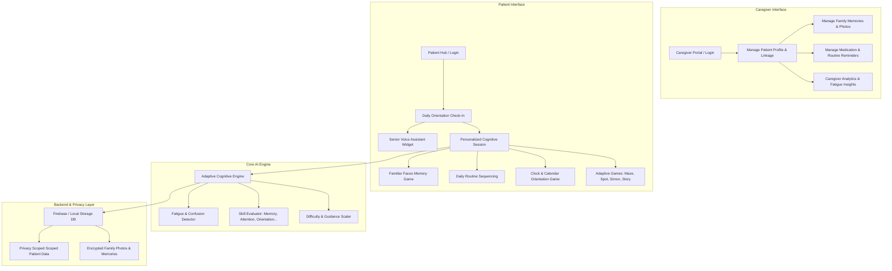

# Implementation Plan — MindWeave Dementia Care Platform (SIH26003)

Transforming the MindWeave platform from a child-focused cognitive application into **"An AI-powered cognitive and memory assistance platform for elderly dementia care"** (SIH26003).

---

## User Review Required

> [!IMPORTANT]
> **Preserving Existing Foundations**: The underlying deterministic adaptive engine (`src/lib/intelliplay/engine.ts`), Firebase authentication, and TanStack Start route tree will be preserved and extended, not rewritten.
> **Medical Disclaimer**: MindWeave will strictly position itself as a *Cognitive & Memory Assistance Companion* and *Activity Monitor*, explicitly avoiding diagnostic or clinical claims.
> **Dignity & Accessibility First**: Gamification terms like "XP", "Level 10 Explorer", "Trophies", and fast timers are replaced with calm progress indicators, voice prompts, and large high-contrast controls.

---

## A. Current Architecture Summary

MindWeave currently runs on a modern web tech stack:
- **Framework**: React 19 + TanStack Start (`@tanstack/react-start`) + TanStack Router (`@tanstack/react-router`).
- **Styling**: Tailwind CSS v4 + custom CSS custom properties (warm palette, playful fonts like Baloo 2/Nunito, card panels, soft shadows).
- **Cognitive Engine (`src/lib/intelliplay/engine.ts`)**: Deterministic multi-dimensional difficulty adaptation engine based on 7 skill dimensions (`spatialReasoning`, `visualAttention`, `workingMemory`, `logicalReasoning`, `problemSolving`, `reactionControl`, `concentration`).
- **Data Persistence & Backend (`src/lib/intelliplay/store.tsx`, `serverFunctions.ts`, `db.ts`, `firebase.ts`)**: Dual-mode persistence (Firebase Auth + Cloud Firestore server functions when online; LocalStorage fallback when offline/anonymous).
- **Current Games**: 4 core games (`maze`, `spot`, `simon`, `detective`) and 5 bonus games (`sudoku`, `advMaze`, `advMemory`, `logicGrid`, `pattern`).
- **Target Audience & Terminology**: Designed for children aged 9–15 ("ChildProfile", character buddies like "fox/rabbit", parent limits, XP, badges, trophy win overlays).

---

## B. SIH26003 Gap Analysis

| Feature / Domain | Current MindWeave Implementation | Required SIH26003 Dementia Care Implementation |
| :--- | :--- | :--- |
| **Target User** | Children aged 9–15 | Elderly individuals with mild-to-moderate dementia / MCI |
| **Profile Model** | `ChildProfile` (Age, Character Avatars, Streaks, XP, Parent limits) | `PatientProfile` (Preferred name, stage, locale, accessibility settings, caregiver linkage, fatigue state) |
| **Cognitive Scope** | 7 general cognitive skills | Memory, Attention, Daily Orientation, Visual Recognition, Routine Sequencing, Language, Executive Function, Fatigue Detection |
| **Orientation & Routine** | None | Daily Orientation Hub (Date, time, weather, location) + Medication/Routine Reminders |
| **Personal Memory** | None | Family Memories Vault, Familiar Faces Photo Flashcards & Memory Matching Game |
| **Voice & Speech** | Text-only interface | Multilingual Speech-to-Text (STT) input + Text-to-Speech (TTS) audio prompts |
| **Caregiver Control** | `Parent Zone` (Screen time slider, bonus toggle) | `Caregiver Portal` (Patient setup, memory upload, reminder schedule, cognitive trend monitoring, fatigue alerts) |
| **UI & Accessibility** | Bright, bouncy, small fonts, timers, cartoon avatars, playful animations | High contrast, large fonts (20px+), voice commands, calm animations, zero-punishment design |
| **Gamification** | High (XP, Levels, Badges, Trophies, Winning popups) | Low/Subtle (Calm progress, gentle encouragement, no failure penalties, optional memory milestones) |

---

## C. Proposed Architecture



---

## D. Exact File-by-File Change Plan

### 1. Kept Unchanged
- `src/lib/utils.ts`
- `src/lib/error-capture.ts`, `src/lib/error-page.ts`, `src/lib/error-reporting.ts`
- `src/router.tsx`, `src/server.ts`, `src/start.ts`
- `vite.config.ts`, `tsconfig.json`

### 2. Modified Files
- **`src/lib/intelliplay/types.ts`**:
  - Replace `ChildProfile` with `PatientProfile`.
  - Add dementia-care skills (`orientation`, `faceRecognition`, `languageRecall`, `routineSequencing`).
  - Add `CaregiverProfile`, `MemoryItem`, `ReminderItem`, `OrientationSession`, `FatigueMetrics`, `SeniorAccessibilitySettings`.
- **`src/lib/intelliplay/engine.ts`**:
  - Adapt skill weighting for dementia domains.
  - Remove competitive scoring; maintain rolling ability calculations focused on accuracy and stability.
  - Implement zero-penalty scaffolding (hints auto-reveal if response lags).
- **`src/lib/intelliplay/store.tsx`**:
  - Rename context hooks and handlers to support caregiver-patient switching and memory/reminder CRUD.
- **`src/lib/intelliplay/serverFunctions.ts`**:
  - Update Firestore collections: `users` (Caregiver), `patients`, `memories`, `reminders`, `game_rounds`.
- **`src/lib/db.ts` & `src/lib/firebase.ts`**:
  - Add schema security helpers and Firestore sub-collection path generators.
- **`src/routes/__root.tsx`**:
  - Update page titles, meta descriptions, typography imports (Inter/Outfit/Nunito), and global accessibility provider wrapper.
- **`src/routes/index.tsx`**:
  - Redesign main page into a calm Senior Patient Home Hub featuring Daily Orientation, Memory Flashcards, and Core Exercises.
- **`src/routes/login.tsx`**:
  - Add Caregiver vs. Patient sign-in mode selector with quick PIN access for patients.
- **`src/routes/dashboard.tsx`**:
  - Transform into a senior-friendly summary view of today's activities and memory highlights.
- **`src/components/intelliplay/shell.tsx`**:
  - Redesign `AppShell` with senior accessibility controls (Font Size Toggle, High Contrast, Voice On/Off) and large navigation icons.
- **`src/styles.css`**:
  - Update design system tokens: high contrast palette, relaxed font sizes (18px base), minimal animation classes.

### 3. Renamed Files
- **`src/routes/parent.tsx` -> `src/routes/caregiver.tsx`**:
  - Evolve Parent Zone into full Caregiver Management Portal (`/caregiver`).

### 4. Removed Components / Unsafe Code
- Cartoon animal avatars (`fox`, `bear`, `rabbit`) -> Replaced with photo upload / simple clean profile initials.
- `GameWinOverlay` trophy popup -> Replaced with calm completion message.
- Child gamification elements (XP progress bars, "Level 5 Explorer", "Claim Brain Boost").

### 5. Newly Created Files
- **`src/lib/intelliplay/orientation.ts`**: Daily Orientation generator (Date, Time, Season, Weather, Location).
- **`src/lib/intelliplay/memoryVault.ts`**: Memory & Familiar Faces state manager.
- **`src/lib/intelliplay/voiceAssistant.ts`**: Web Speech API Speech-to-Text & Text-to-Speech service handler.
- **`src/lib/intelliplay/fatigue.ts`**: Real-time reaction drift and error clustering detector.
- **`src/routes/orientation.tsx`**: Daily Orientation check-in page.
- **`src/routes/memories.tsx`**: Family Memories & Photo Flashcards view.
- **`src/routes/reminders.tsx`**: Medication & Routine Schedule view.
- **`src/routes/play.memory.tsx`**: Familiar Faces Memory Recognition game.
- **`src/routes/play.sequencing.tsx`**: Daily Routine Order game.
- **`src/routes/play.orientation.tsx`**: Interactive Clock & Calendar game.
- **`src/components/SeniorVoiceBar.tsx`**: Global Voice Command & Audio Assistant Widget.
- **`src/components/AccessibilityToolbar.tsx`**: Font size, high-contrast, and voice guidance controls.

---

## E. Proposed TypeScript Data Models

```typescript
export type CognitiveSkillKey =
  | "workingMemory"
  | "visualAttention"
  | "spatialReasoning"
  | "logicalReasoning"
  | "concentration"
  | "reactionControl"
  | "problemSolving"
  | "orientation"
  | "faceRecognition"
  | "languageRecall"
  | "routineSequencing";

export type SeniorAccessibilitySettings = {
  fontSize: "medium" | "large" | "extra-large";
  highContrast: boolean;
  voiceGuidance: boolean;
  speechRate: number; // 0.7 to 1.0 (slower for dementia care)
  autoReadPrompts: boolean;
  simplifiedControls: boolean;
};

export type FatigueMetrics = {
  currentFatigueScore: number; // 0 to 100
  slowDownRatio: number; // reaction time slowdown factor
  errorClusterCount: number;
  recommendedBreak: boolean;
};

export type MemoryItem = {
  id: string;
  patientId: string;
  relation: string; // e.g. "Daughter", "Grandson", "Spouse"
  name: string;
  photoUrl: string;
  audioCaptionUrl?: string;
  notes?: string;
  keyEvents: string[]; // e.g. "Loves gardening", "Visited in July"
  createdAt: number;
};

export type ReminderItem = {
  id: string;
  patientId: string;
  title: string;
  type: "medication" | "routine" | "activity" | "appointment";
  time: string; // HH:mm
  days: string[]; // ["Mon", "Tue", ...]
  completedToday: boolean;
  audioPrompt?: string;
};

export type PatientProfile = {
  id: string;
  caregiverId: string;
  name: string;
  preferredName: string;
  age: number;
  dementiaStage: "early" | "moderate" | "mci";
  language: string; // "en" | "hi" | "mr" | "ta" | etc.
  accessibility: SeniorAccessibilitySettings;
  createdAt: number;
  skills: Record<CognitiveSkillKey, number>;
  difficulty: Record<string, any>;
  history: RoundResult[];
  patterns: string[];
  fatigueState: FatigueMetrics;
};

export type CaregiverProfile = {
  uid: string;
  email: string;
  name: string;
  linkedPatientIds: string[];
  selectedPatientId: string | null;
  notificationPreferences: {
    emailAlerts: boolean;
    fatigueAlerts: boolean;
    missedReminders: boolean;
  };
};
```

---

## F. Recommended Implementation Order

### Phase 1: Core Transformation
1. Refactor TypeScript Data Models (`types.ts`, `engine.ts`, `store.tsx`).
2. Implement Senior Accessibility System (`styles.css`, `AccessibilityToolbar.tsx`).
3. Update Auth & Routing for Caregiver -> Patient relationships (`login.tsx`, `caregiver.tsx`).
4. Sanitize existing games (`maze`, `spot`, `simon`, `detective`) to remove child terminology and fast timers.

### Phase 2: Memory Assistance & Reminders
1. Build `MemoryVault` service & family photo manager (`memoryVault.ts`).
2. Build Family Memory Game (`play.memory.tsx`).
3. Build Reminders & Routine Engine (`reminders.tsx`).

### Phase 3: Voice Assistant & Multilingual Support
1. Build Web Speech API integration (`voiceAssistant.ts`, `SeniorVoiceBar.tsx`).
2. Add voice prompts for orientation and memory games.
3. Implement multilingual dictionary for key prompts (English, Hindi, regional).

### Phase 4: Adaptive AI & Fatigue Engine
1. Integrate real-time fatigue detection (`fatigue.ts`).
2. Update adaptive cognitive engine for dementia domains (`orientation`, `faceRecognition`, `routineSequencing`).
3. Add gentle break prompts and automatic scaffolding.

### Phase 5: Caregiver Portal, Analytics & Privacy Verification
1. Build comprehensive Caregiver Analytics Dashboard (`caregiver.tsx`).
2. Implement local-first privacy encryption for sensitive photos and memories.
3. Validate zero medical claims, clear disclaimers, and smooth end-to-end user flow.

---

## Verification Plan

### Automated Verification
- Run `npm run build` to verify clean TypeScript compilation and TanStack Start route generation.
- Run `npm run lint` to ensure code formatting and standard adherence.

### Manual Verification
- Test Caregiver login -> Patient linking flow.
- Test Senior Patient Hub navigation with large text, high contrast, and voice assistance.
- Test Daily Orientation, Family Memory Recall, and Routine Reminder interactions.
- Confirm adaptive engine responds smoothly without punishing performance errors.
